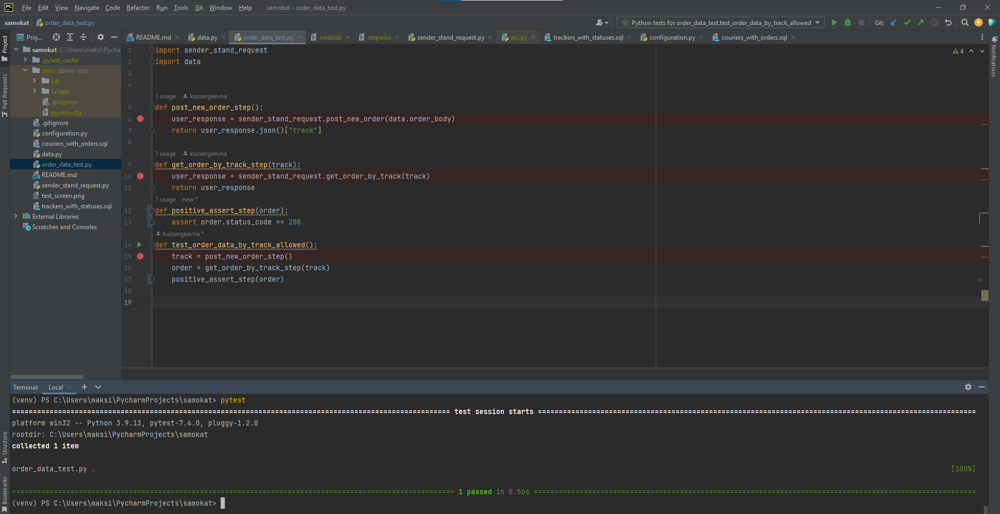

# SQL запросы второго бллока практического задания.
- [курьеры с активными заказами](couriers_with_orders.sql)
- [заказы с мапингом статусов](trackers_with_statuses.sql)
# Тест для проверки доступа по трекеру к заказу.
- Для запуска тестов должны быть установлены пакеты pytest и requests
- Запуск всех тестов выполянется командой pytest
 
